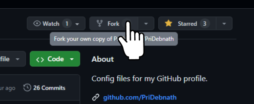
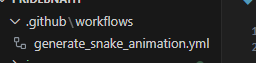

# 1.a:  Fork the repository

## 1.b: or create a repo with similar folder and files

 

# 2: Run the workflow by clicking the buttons ( below )
### Actions (1), 
### Generate Snake Animation (2) - workflow name
### Run workflow (3)
### Run workflow (4) - in green button

### let the workflow run successfully
 
# 3: Select **output** branch from dropdown ( Switch branches/tags )

 
# 4: Open generated svg files

 
# 5: Use the svg 🎉

### you can use those files directly or copy the svg code by going to code tab